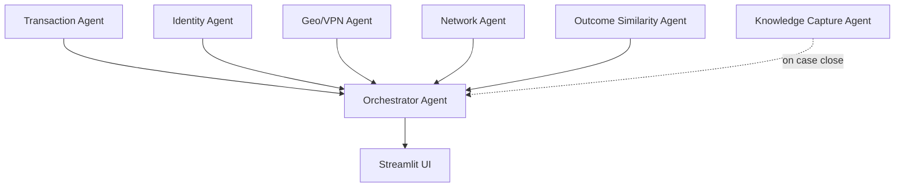

# Multi-Agent Fraud Investigation Platform

This directory holds the **agentic fraud ops** design: a team of specialist agents plus one orchestrator that talks to the UI.

## Big picture

- **One senior investigator (orchestrator):** receives structured findings from specialists, assesses overall risk, explains why the alert was triggered, assigns priority, recommends action. **Only this agent talks to the UI.**
- **Specialist agents:** each has a narrow job, sees only what it needs, produces structured outputs, and is auditable.

## Agents

| Agent | Role | Output (high level) |
|-------|------|---------------------|
| **Orchestrator** | Senior investigator; merges specialist results; talks to UI | risk_level, confidence, key_drivers, priority, investigation_summary |
| **Transaction** | Transaction/behavior anomalies | anomaly_score, detected_patterns, short explanation |
| **Identity** | Identity verification risk | identity_risk, indicators, explanation |
| **Geo/VPN** | Geographic and access risk | geo_risk, indicators, explanation |
| **Network** | Account relationships, clusters | cluster_size, known_fraud_links, shared_signals, explanation |
| **Outcome Similarity** | Compare to historical investigator outcomes | fraud_likelihood, similar_confirmed_cases_count, explanation |
| **Knowledge Capture** | Runs on case close; reusable pattern | key_signals, behavioral_pattern, final_outcome, one_sentence_description |

## Prompts

Exact LLM-facing prompts are in [prompts.py](prompts.py). Classical models / rules feed into them as **structured input** (e.g. feature vectors, similarity counts, risk levels). Each agent has:

- `system_prompt`: copy-paste ready for the LLM
- `output_fields`: expected JSON keys for parsing and passing to the orchestrator

## Mapping and execution order

**[MAPPING.md](MAPPING.md)** defines:

- **Main layout** — Alert queue → Investigation dashboard (orchestrator summary, tabs, actions).
- **Component ↔ Agent** — Which UI piece is driven by which agent (queue sort = Outcome; risk explanation = Orchestrator; tabs = Transaction, Identity, Geo, Network; Similar cases = Outcome + Knowledge; case close = Knowledge Capture).
- **Execution order:**
  - **On alert creation:** Behavior → Identity → Geo → Network → Outcome Similarity → Orchestrator (Network can be cached/precomputed).
  - **On case open:** Re-run Orchestrator only (fast).
  - **On case close:** Knowledge Capture → store outcome → update similarity index.

Orchestrator decides who runs, merges results, produces the final explanation. Specialists are invoked with their structured inputs and return structured outputs; no agent other than the orchestrator talks to the UI. Execution-order constants are in [prompts.py](prompts.py): `ORDER_ON_ALERT_CREATION`, `ORDER_ON_CASE_OPEN`, `ORDER_ON_CASE_CLOSE`.
